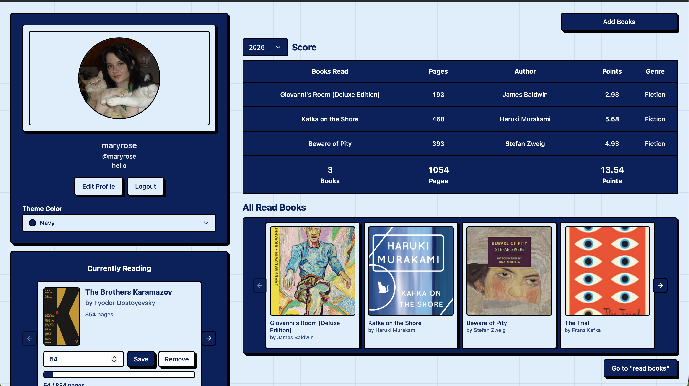
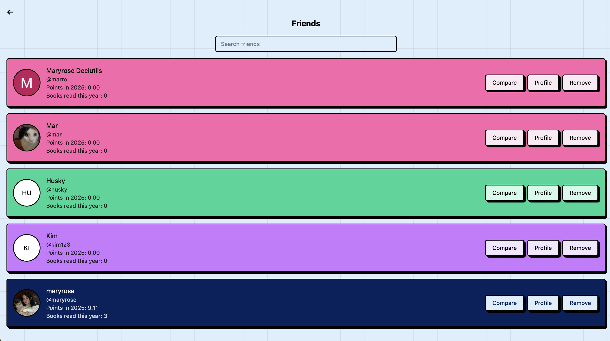

# Reading Website

A full-stack social reading tracker for logging books, tracking yearly reading stats, organizing shelves, and comparing progress with friends.

This project was built as a practical reading competition app: users can sign in with Google, search Google Books, add custom editions, manage books across reading shelves, track current reading progress, customize their profile/theme, and view friends' reading activity.

## Highlights

- Google OAuth authentication with protected app routes
- Google Books search with flexible matching and manual "add your own version" fallback
- Three-shelf book workflow: read books, currently reading, and want to read
- Completion date tracking, points calculation, page progress, and reading charts
- Friend requests, friend profiles, friend reading shelves, and comparison charts
- Per-user theme colors, including light and dark-friendly options
- Responsive React UI with reusable feature components and neobrutalist styling
- Full-stack monorepo structure with a React/Vite frontend and Express/MongoDB API

## Screenshots

Add screenshots after deployment to show the main user flows. Store them in `docs/screenshots`.

### Login


### Dashboard



### Book Shelves


### Friends Page and Compare




## Tech Stack

**Frontend**

- React
- TypeScript
- Vite
- React Router
- Tailwind CSS
- Radix UI primitives
- Google OAuth client
- Axios

**Backend**

- Node.js
- Express
- MongoDB
- Mongoose
- JWT auth with HTTP-only cookies
- Google Auth Library
- Google Books API

**Tooling**

- ESLint
- TypeScript project build
- Concurrent frontend/API development scripts
- Root-level verification command for frontend and backend checks

## Core Features

### Books and Shelves

Users can search for books, choose an edition, upload/customize cover data, and place each book onto a shelf:

- **Read Books**: requires a completion date and contributes to yearly stats.
- **Currently Reading**: tracks current page and displays a progress bar.
- **Want To Read**: keeps future reads separate from completed books.

Books can be moved between shelves later. Existing shelf actions are disabled so users cannot accidentally re-add a book to the same shelf.

### Reading Analytics

The dashboard includes charts and totals for yearly reading activity:

- books read
- pages read
- points earned
- author and genre/category summaries

The scoring model is calculated from page count and stored with each saved book.

### Social Reading

Users can:

- set a unique username before sending friend requests
- search for other users
- send, accept, or reject friend requests
- view a friend's profile and shelves
- add a friend's book to their own shelves
- compare reading stats against a friend

Friend profile pages use the friend's theme color so the viewed profile feels like that user's space.

### Personalization

Users can update their display name, username, bio, avatar, and app theme color. Theme settings persist per signed-in user.

## Architecture

This repository is organized as a small full-stack monorepo.

```text
apps/
  api/    Express API, MongoDB models, auth middleware, route modules
  web/    React app, feature modules, shared UI, app routes
docs/     project structure notes
```

The frontend follows a feature-oriented structure inspired by Bulletproof React:

```text
apps/web/src/
  app/          app composition and route pages
  components/   shared UI primitives
  config/       browser environment config
  features/     auth, books, and friends domain modules
  lib/          reusable client libraries
  utils/        shared utilities
```

Feature modules own their domain-specific API calls, components, types, and utilities:

```text
features/
  auth/
    api/
    components/
    types/

  books/
    api/
    components/
    types/
    utils/

  friends/
    api/
    components/
    types/
    utils/
```

This keeps app routes focused on composition while reusable behavior lives with the feature that owns it.

## API Overview

The Express API exposes route modules for:

- `auth`: Google sign-in, current user session, profile updates, theme updates
- `books`: saved books, Google Books search, shelf updates, deletion
- `friends`: friend search, requests, friend lists, friend books, social comparison data

Authentication is handled through middleware that verifies the signed-in user before protected book and friend operations.

## Available Scripts

```bash
npm run dev       # Start API and web app together
npm run dev:web   # Start only the Vite frontend
npm run dev:api   # Start only the Express API
npm run build     # Build the frontend
npm run lint      # Lint the frontend
npm run test      # Run frontend component tests and API tests
npm run check     # Run lint, tests, build, and backend syntax checks
```

## Verification

The main project verification command is:

```bash
npm run check
```

It runs the frontend lint/build pipeline, automated tests, and syntax-checks the backend route, middleware, and config files.

## What This Project Demonstrates

- Building a full-stack authenticated application from end to end
- Designing domain-based frontend architecture instead of placing all logic in routes
- Integrating third-party APIs while handling imperfect search results and fallback workflows
- Modeling social features with backend validation and user-facing UI states
- Managing protected routes, persisted user settings, and authenticated API calls
- Creating a polished, iterative UI with reusable components and responsive layouts
- Maintaining a monorepo with root-level scripts and a clear verification path
- Adding automated frontend component tests and backend API route tests

